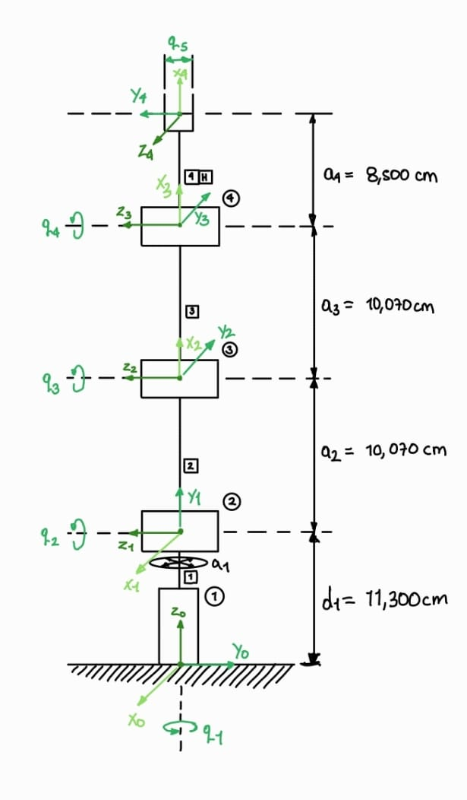
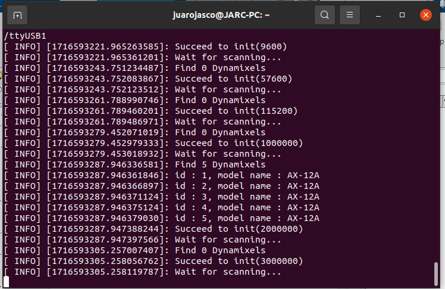
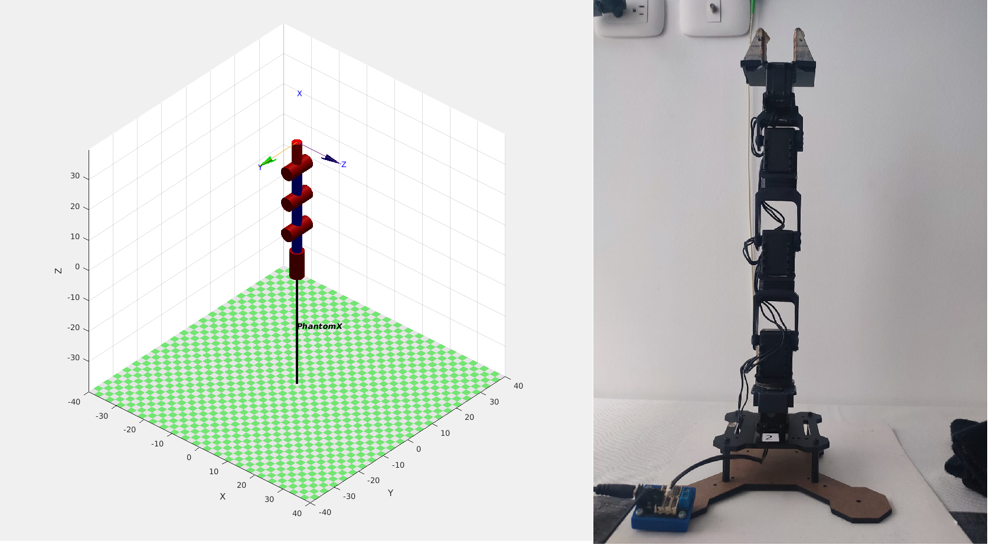
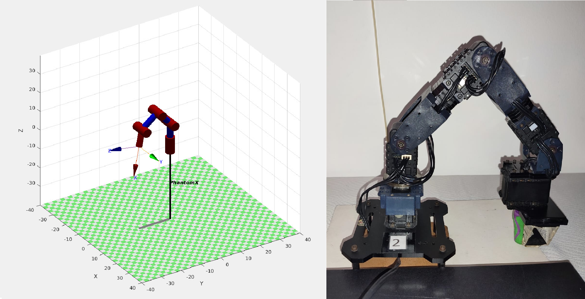
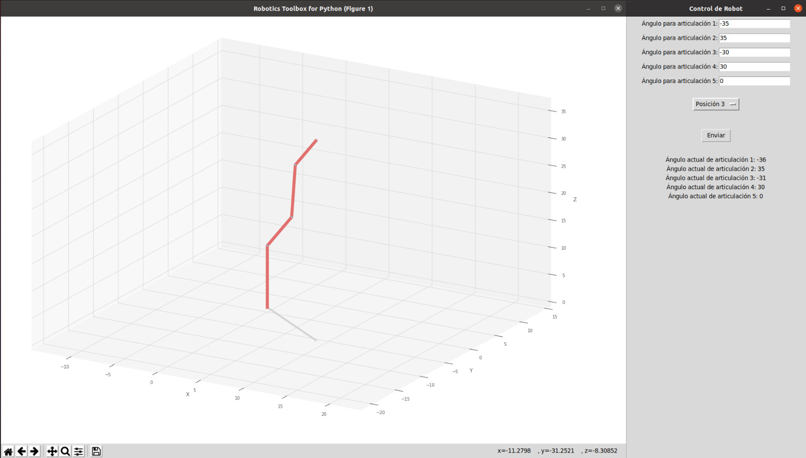

# Laboratorio No. 4 - Cinemática Directa - Phantom X - ROS

- David Andrés Ricaurte de Lima  
  *Ingeniería Mecatrónica*  
  *Universidad Nacional de Colombia*  
  Bogotá, Colombia  
  dricaurte@unal.edu.co

- Juan Antonio Rojas Cobos
  *Ingeniería Mecatrónica*  
  *Universidad Nacional de Colombia*  
  Bogotá, Colombia  
  juarojasco@unal.edu.co

En esta práctica, se desarrollan las habilidades necesarias para controlar el robot Phantom X Pincher utilizando ROS. Los objetivos principales incluyen la creación y gestión de Joint Controllers para los servomotores Dynamixel AX-12, la manipulación de tópicos de estado y comando, el uso de servicios ROS para enviar comandos, y la integración del robot con Python.

## Índice

1. [Objetivos](#objetivos)
2. [Requisitos](#requisitos)
3. [Resultados](#resultados)
    - [Mediciones](#mediciones)
    - [Análisis](#análisis)
    - [ROS](#ros)
    - [Toolbox](#toolbox)
    - [Conexión con Python](#conexión-con-python)
    - [Python + ROS + Toolbox](#python--ros--toolbox)


## Objetivos

- Crear todos los Joint Controllers con ROS para manipular servomotores Dynamixel AX-12 del robot Phantom X Pincher.
- Manipular los tópicos de estado y comando para todos los Joint Controllers del robot Phantom X Pincher.
- Manipular los servicios para todos los Joint Controllers del robot Phantom X Pincher.
- Conectar el robot Phantom X Pincher con MATLAB o Python usando ROS.

## Requisitos

- Ubuntu versión 20.xx, preferiblemente 20.04 LTS, con ROS.
- Espacio de trabajo para catkin correctamente configurado.
- Paquetes de Dynamixel Workbench: [Dynamixel Workbench](https://github.com/fegonzalez7/rob_unal_clase3)
- Paquete del robot Phantom X: [px_robot](https://github.com/felipeg17/px_robot)
- Python o MATLAB 2015b o superior instalado en el equipo.
- Robotics Toolbox de MathWorks (Disponible desde la versión 2015 en adelante).
- Toolbox de robótica de Peter Corke.
- Un manipulador Phantom X Pincher con su base en madera.

## Resultados

### Mediciones

- **Descripción:** Se identificaron los eslabones y las articulaciones. Posteriormente se establecieron las longitudes de eslabón para cada articulación del robot Phantom X Pincher utilizando un calibrador.



<p align="center">Figura 1: Diagrama de mediciones</p>


- **Archivos relacionados:** [Mediciones](./resultados/mediciones.md)

### Análisis

- **Descripción:** Con las dimensiones medidas se obtuvieron los parámetros DH del robot Phantom X Pincher.


| i | &theta;<sub>i</sub>| d<sub>i</sub> | a<sub>i</sub> | &alpha;<sub>i</sub> |
|-----------|-----------|-----------|-----------|-----------|
| 1 | q<sub>1</sub> | 11,30 | 0 | &pi;/2 |
| 2 | q<sub>2</sub> + &pi;/2 | 0 | 10,07 | 0 |
| 3 | q<sub>3</sub> | 0 | 10,07 | 0 |
| 4 | q<sub>4</sub> | 0 | 8,50 | &pi;/2 |


### ROS

- **Descripción:** Se creó un script que publica a los tópicos y llama a los servicios correspondientes para realizar el movimiento de cada articulación del manipulador.



<p align="center">Figura 2: Consola de conexión de los servomotores con ROS</p>

Para ejecutar el movimiento con ROS se definen las posiciones de Home y Objetivo:
| i | Home | Objetivo |
|-----------|-----------|-----------|
| M1 | 512 | 820 |
| M2 | 512 | 650 |
| M3 | 512 | 820 |
| M4 | 512 | 650 |
| M5 | 512 | 204 |



<p align="center">Figura 3: Posición Home</p>



<p align="center">Figura 4: Posición Objetivo</p>

Para esto se hizo un script en Bash diseñado para controlar los motores Dynamixel AX-12 del robot Phantom X Pincher a través de ROS. Se divide en tres secciones principales:

1. **Habilitar Torques:** En esta sección, se activa el torque para cada motor del robot. El torque es necesario para que los motores puedan recibir y ejecutar comandos de movimiento.

2. **Posición Home:** Aquí se configura cada motor para moverse a una posición angular inicial, comúnmente conocida como "home". Cada motor se establece con una velocidad de movimiento y una posición objetivo.

3. **Posición Objetivo:** En esta parte, los motores se mueven a una posición objetivo específica diferente de la posición "home". Nuevamente, se configura la velocidad de movimiento y la posición objetivo para cada motor.

El script utiliza los servicios proporcionados por ROS para enviar comandos a los motores Dynamixel, tales como habilitar el torque y establecer la velocidad y la posición deseada para cada motor. Las pausas entre cada comando (`sleep`) garantizan que cada movimiento se complete antes de iniciar el siguiente. En resumen, este script automatiza el proceso de control de los motores Dynamixel del robot Phantom X Pincher, permitiendo establecer tanto posiciones iniciales como objetivos con precisión.

El resultado del movimiento se puede ver en el siguiente video:

[Video Movimiento con ROS](https://youtube.com/shorts/nNqhN4IGQ14?feature=share)


- **Archivos relacionados:** [ROS Script](PhantomX.sh)

### Toolbox

- **Descripción:** Utilzando el Toolbox de Peter Corke se creó un script que permite graficar el modelo a partir de las entradas por consola.

El código en Python utiliza la biblioteca `roboticstoolbox` para modelar y controlar un robot manipulador mediante los parámetros Denavit-Hartenberg (DH). Primero, se definen los parámetros DH de cada eslabón del robot, que incluyen la distancia y el ángulo entre eslabones. Estos parámetros se almacenan en una lista llamada `params`. Luego, se crea una lista de eslabones `links`, donde cada eslabón es un objeto `RevoluteDH` inicializado con los parámetros DH correspondientes. Con estos eslabones, se instancia el objeto `DHRobot` que representa el robot serial completo. Se asigna una herramienta (`tool`) al robot usando una matriz de transformación homogénea. El código entra en un bucle `while` que solicita al usuario ángulos para cada articulación del robot en grados, los convierte a radianes, y almacena estos valores en la lista `joint_values`. Finalmente, el robot se mueve a la posición objetivo especificada por estos ángulos y se genera una representación gráfica del robot en la posición deseada usando `robot.plot(robot.q)`.

- **Archivos relacionados:** [Toolbox Script](PhantomXtoolbox.py)

### Análisis en Matlab con Robotics Toolbox

Este código de MATLAB define y visualiza un modelo cinemático de un brazo robótico utilizando la Toolbox de Robótica de Peter Corke, basado en los parámetros de Denavit-Hartenberg (DH).

```matlab
%Parametros DH usando Toolbox de Peter Corke
L1=11.30 ; L2 = 10.07 ; L3 = 10.07 ; L4 = 8.50 ;

%Serie de eslabones
%L(i) = Link ([Th d a alph]);
L(1)=Link([0 11.3 0 pi/2]);
L(2)=Link([0 0 10.07 0]);
L(3)=Link([0 0 10.07 0]);
L(4)=Link([0 0 8.50 pi/2]);

Rob = SerialLink (L);
Rob.name = 'PhantomX';

Rob.plot([0 pi/2 0 0]);
```

### Conexión con Python

- **Descripción:** Creación de un script que permite publicar en cada tópico de controlador de articulación y suscribirse a ellos para retornar la configuración de 5 ángulos en grados.

El primer script en Python controla los motores Dynamixel a través de ROS. Utiliza la biblioteca rospy para interactuar con ROS y DynamixelCommand para enviar comandos a los motores. Define límites articulares para cada motor en el diccionario joint_limits. La función call_service se encarga de invocar el servicio /dynamixel_workbench/dynamixel_command para enviar comandos a los motores, mientras que check_limits verifica que los valores de posición de los motores estén dentro de los límites permitidos. En la función principal main, se inicializa el nodo ROS, se habilitan los torques de los motores, y se establecen posiciones de "home" y "objetivo" para los motores, asegurándose de que cada posición esté dentro de los límites antes de enviar los comandos de velocidad y posición.


- **Archivos relacionados:** [Python + ROS | Control de articulaciones](conexion1.py)

Este último script, además de controlar los motores Dynamixel y establecer posiciones como en el primer script, añade la funcionalidad de suscribirse a los tópicos de estado de las articulaciones para monitorear en tiempo real las posiciones de las mismas. La función joint_states_callback se encarga de imprimir los nombres y posiciones de las articulaciones cuando se reciben datos del tópico /dynamixel_workbench/joint_states. Esto permite obtener retroalimentación en tiempo real sobre el estado de las articulaciones, lo cual no se realiza en el primer script. Además, el script utiliza rospy.spin() para mantener el nodo activo y continuar recibiendo actualizaciones de los estados de las articulaciones.


El funcionamiento de este script se puede ver en el siguiente video:

[Video Movimiento con ROS](https://youtu.be/CMx_UWP4ikA)


- **Archivos relacionados:** [Python + ROS | Subscripción a tópicos](conexion2.py)

### Python + ROS + Toolbox

- **Descripción:** Desarrollo de un código en MATLAB que envía la posición en ángulos deseada a cada articulación del robot utilizando las herramientas de ROS + Dynamixel.

El código realiza varias funciones clave para controlar y visualizar el robot Phantom X Pincher utilizando ROS y herramientas del `roboticstoolbox`, así como una interfaz gráfica con `tkinter`:

- **Gráfica de la configuración del robot**: Utilizando los parámetros Denavit-Hartenberg (DH) definidos para cada eslabón del robot, se instancia un objeto `DHRobot` que representa el modelo del robot. Este modelo se actualiza y se visualiza con la configuración actual del robot mediante el método `plot()` del objeto `robot`, asegurando que la gráfica coincida con la configuración del robot real.

- **Pruebas de las poses generadas a partir de los valores articulares especificados**: El código permite ingresar valores articulares (ángulos) para las articulaciones del robot a través de la interfaz gráfica. Estos valores se verifican contra los límites articulares definidos y se escalan adecuadamente. Luego, se actualiza el modelo simulado del robot con estos valores y se visualiza la nueva configuración. Simultáneamente, se envían comandos ROS para mover los motores Dynamixel a las posiciones objetivo, permitiendo probar las poses generadas en el robot real.

- **Creación de una interfaz de usuario (HMI)**: La interfaz gráfica de usuario se crea utilizando `tkinter`, proporcionando entradas para los ángulos de las articulaciones y opciones para seleccionar posiciones base predefinidas. Además, la interfaz muestra los ángulos actuales de las articulaciones del robot, actualizándose en tiempo real después de cada movimiento. Esto facilita la interacción del usuario con el robot, permitiendo controlar y visualizar la configuración del robot de manera intuitiva.



<p align="center">Figura 5: Interfaz Control</p>


El resultado del movimiento utilizando la interfaz en Python se puede ver en el siguiente video:

[Video Movimiento con ROS + Python](https://youtu.be/wEqNH57gNPk)

- **Archivos relacionados:** [Python + ROS Script](PhantomXF.py)


